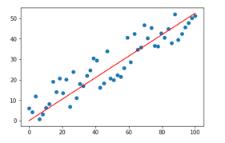

# Data Science do Zero - Stack Tecnologias

## Conteúdo do curso

### Módulo 01 - Conceitos e Aplicações - Introdução teórica aos conceitos de Ciência de dados (DS)

### Módulo 02 - Docker - Containers para encapsulamento de projetos de DS 

### Módulo 03 - Principais aspectos de Python 

### Módulo 04 - Python para Análise de Dados

### Módulo 05 - SQL para Data Science

### Módulo 06 - Visualização de Dados

### Módulo 07 - Estatística Aplicada e Pré Processamento de Dados

Introdução a conceitos básicos de estatística, como estatística descritiva e amostragem, sob o contexto prático e teórico. Abordamos desde cálculo de desvio padrão de uma distribuição até situações nas quais cada métrica se encaixa melhor.

Neste módulo também estudamos sobre métodos para remoção de outliers a partir do desvio padrão de um conjunto de dados e também sobre métodos de normalização de dados, que são necessários quando temos dados fora de escala, prejudicando assim a análise ou até mesmo para a implementação de modelos baseados em métodos que usem o conceito de distância (comumente a eucliana). 

### Módulo 08 - Mineração de Texto (ou NLP)

Neste módulo tratamos sobre conceitos de processamento de linguagem natural (NLP, em inglês).

NLP consiste de técnicas para extrairmos valor de dados baseados em texto. Para extrair valor de dados do tipo texto podemos utilizar algumas técnicas como 

	- Dicionário Léxico: dicionário de palavras usado para extrairmos o significado de determinada palavra;
	- Técnicas de Machine Learning para classificação de padrões, como sentimento positivos, negativos ou neutros; 
	- Algoritmos de Deep Learning para resolver algum tipo de problema envolvendo dados do tipo texto, como tradução de sentenças, análise de sentimento, etc.
	
Para o tratamento de variáveis do tipo texto (*pré processamento dos dados*) podemos usar como ferramenta a biblioteca NLTK, que traz consigo algumas técnicas importantes, como

	- Stemização: técnica usada para reduzir uma palavra ao seu radical, i.e., o elemento que contém o significado básico da palavra
		Exemplo: trabalhou -> trabalh
		Exemplo: trabalhava -> trabalh
		Exemplo: trabalha -> trabalh
		(SnowballStemmer: Steming em Inglês)
		
	- Lematização: reduz uma palavra ao seu "lemma", que é a forma canônica de uma palavra, i.e., que gera sua definição. (No NLTK: WordNetLemmatizer.) Podemos trazer o lemma de uma palavra em conjunto com sua função gramatical, "Part of Speech"
	
	- StopWords: palavras com pouco significado em frases, como artigos "é", "o", "a", etc.
		Exemplo de stopwords em pt-br: 'hão','houve','houvemos', 'houveram', etc.
		
	- Part of Speech: técnica para identificar a função gramatical de uma palavra em uma frase
		Um problema que pode ser encontrado nesta técnica é sua dependência em relação ao idioma utilizado
		
	- Tokenização: processo de reconhecer e separar palavras ou sentenças em uma frase.
	
	- n-grams: são sequências de palavras de n itens formadas a partir de uma palavra base.
		Exemplo: trigrams(['O rato', 'roeu', 'roupa', 'do rei', 'de roma']): 
		[('O rato', 'roeu', 'roupa'), ('roeu', 'roupa', 'do rei'), ('roupa', 'do rei', 'de roma')]

	
### Módulo 09 - Algoritmos de Machine Learning 

#### 9.0 Lidando com Classes Desbalanceadas e entendo a Validação Cruzada

##### Classes desbalanceadas

Classes desbalanceadas ocorrem quando temos um número muito maior de amostras de uma classe do que outra. Um exemplo simples desse caso é quando estamos tentando classificar se uma transação de cartão de crédito é ou não fraudulenta. Neste caso existem muito mais transações *não* fraudulentas do que fraudulentas.
Quando temos este tipo de situação pode ocorrer de nosso algoritmo de classificação performar melhor sobre um tipo de classe em detrimento da outra, de modo que o balanceamento entre as classes se faz necessário.

Alguns métodos para balanceamento de classes são:

	- Undersampling (NearMiss): consiste em reduzirmos de modo aleatório o número de exemplos da classe majoritária.
	
	- Oversampling: consiste em replicar de modo aleatório os dados da classe minoritária.
		- Smote: método de oversampling que gera dados sintéticos da classe minoritária.
		
	- Feature Engineering: processo de geração de novas features de modo a dar mais robustez para o modelo de aprendizado de máquina.
	
Note que podemos avaliar se nosso algoritmo de aprendizado está sendo afetado negativamente pelo desbalanceamento entre as classes olhando paras as métricas *precision*, *recall* e *confusion_matrix*, que avaliam como o modelo performa em cada classe.

##### Validação Cruzada

Validação Cruzada é um técnica que permite eliminar a variância sobre o nosso conjunto de treino e teste.

No caso, é uma técnica que consiste em dividir nossos dados em *k folds* que serão o número de grupos usados para treino e teste. 

Por exemplo, se temos um conjunto de dados e escolhemos nosso k=5, então faremos 5 divisões dos nossos dados de modo a usar 1 divisão para teste e 4 para treino, durante 5 etapas, como mostrado na imagem abaixo.

Cross Validation (from sklearn)

#### 9.1 K-Nearst Neighboors (KNN)

KNN é um algoritmo majoritariamente usado para classificação baseado em distância (usualmente a euclidiana, mas podemos ter outras). Sua hiótese básica é que dados semelhantes devem estar no mesmo espaço de dispersão.
O valor *k* determina o número de vizinhos que serão usados como comparação para determinar a classe de uma nova amostra.

De modo geral, para cada nova amostra calculamos sua distância em relação a todos os pontos do dataset, após isso retorno o conjunto dos *k* pontos mais próximos e classificamos a nova amostra de acordo com a classe mais presente neste conjunto.

KNN - Classifica a nova amostra como sendo a classe que mais aparece no conjunto de *k* pontos

#### 9.2 Regressão Linear

Regressão Linear é um algoritmo para regressão (ou previsão de valores contínuos) que busca escolher a melhor reta que modela um conjunto de dados. 
De modo geral, este algoritmo busca achar os melhores parâmetros *w* e *b* da reta $$y = w*X + b$$ que se ajusta a um conjunto de dados. 

Podemos avaliar se um modelo do tipo regressão linear (de modo mais geral, qualquer tipo de modelo de regressão) está performando bem olhando para as seguintes métricas:
	- Mean Square Error (ou Erro Quadrático Médio): esta medida retorna o quanto estamos errando em nossa predição (yhat) com relação aos valores reais (y)
		$$MSE = \sum_{i=1}^n (y_{i}-yhat_i)^2 / n$$
		
	- Root Mean Square Error (raiz do MSE): medida mais intuitiva já que está na mesma unidade da variável resposta y
		$$RMSE = \sqrt{MSE}$$
		
Além da regressão linear, que olha somente para uma dimensão, podemos ter também a *regressão multilinear*, que basicamente recebe mais de um valor de entrada e busca o melhor hiperplano que descreve nosso conjunto de dados: $$y = w_1*x_1 + \cdots + w_m*x_m + b$$.

##### Hipóteses para a regressão linear

Para usarmos a regressão linear devemos ter satisfeitas as seguintes hipóteses:
	1 - Linearidade entre os dados,
	2 - Independência entre os resíduos, i.e., não deve existir correlação entre os resíduos,
	3 - Invariância dos resíduos,
	4 - Normalidade dos resíduos, i.e., os resíduos do modelo devem seguir uma distribuição normal.

#### 9.3 Regressão Logística

#### 9.4 SVM

#### 9.5 K-Means

#### 9.6 Naive Bayes

#### 9.7 Decision Trees

